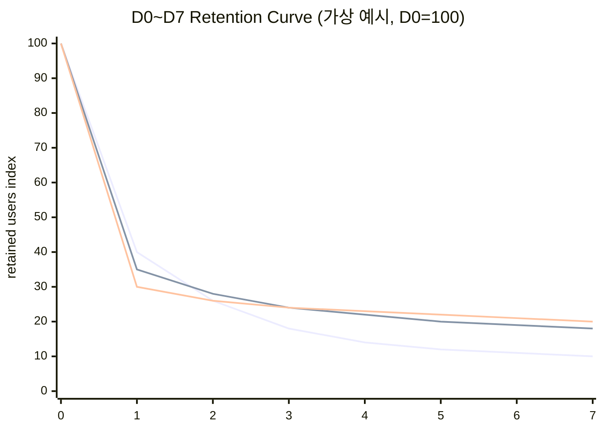

# 게임 장르별 초반 유저 이탈 방지 기획 요소 연구

## Executive Summary

초반 이탈(첫 1시간·첫 1일·첫 7일)은 장르가 달라도 “가치 인지(이 게임이 내 시간/돈을 쓸 가치가 있는가?)”와 “역량 형성(나는 이 게임을 할 줄 아는가?)”이 성립하기 전에 **마찰(friction)** 이 먼저 체감될 때 발생한다. 특히 온보딩에서 ‘능력감(competence)’이 형성되지 않으면 이탈이 크게 늘 수 있다는 UX 연구·실무 관찰이 반복적으로 보고된다. citeturn25search9turn25search31 또한 모바일의 경우, 국내 조사에서 모바일 게임 이용률이 매우 높고(예: 2024 실태조사에서 모바일 91.7%), 일 평균 이용 시간도 긴 편(주중 171분, 주말 253분)으로 나타나 ‘초반 진입 경험’이 곧 시장 성과로 연결될 여지가 크다. citeturn24search10turn27search9

본 보고서는 장르별 특성에 따라 초반 이탈 원인을 **심리(기대·인지부하·동기) / 기술(성능·안정성·호환성) / 경제(과금·광고·공정성 인식)**으로 분해하고, 시스템·콘텐츠·UI/UX 관점에서 “즉시 실행 가능한” 기획 항목을 우선순위화하였다. (미확인 사항은 ‘미지정’으로 표기)

핵심 권장안은 다음 4가지로 수렴한다.

첫째, **첫 보상까지의 시간(Time-to-First-Reward, TTFR)과 첫 재미까지의 시간(Time-to-First-Fun, TTFF)** 을 장르별로 목표치로 고정하고, 이 구간의 로그/퍼널을 ‘제품 KPI’로 승격한다. 고전적 “첫 15분/첫 5분”의 중요성은 오래전부터 강조되어 왔고, 모바일 UA·리텐션에서도 “첫날 경험”이 핵심이라는 주장이 반복된다. citeturn25search20turn32search16

둘째, **튜토리얼은 ‘설명’이 아니라 ‘맥락 속 행동’으로 설계**하고, (1) 짧게, (2) 반복 가능한 학습, (3) 실패 안전장치(fail-safe), (4) 스킵·재시도·복귀 경로를 포함한다. 텍스트만으로 가르치거나, 즉시 시도 가능한 맥락이 없으면 기억·학습이 약해진다는 지적이 있다. citeturn25search31turn25search9

셋째, **기술 품질(크래시/ANR/로딩/호환성)** 을 “리텐션 기능”으로 다룬다. 플랫폼은 기술 품질 기준을 명시적으로 강화해 왔고, 품질 지표는 스토어 노출·평판과도 연결된다. citeturn0search26turn0search15 모바일 게임 호환성 이슈가 사용자 경험·비용 손실로 이어질 수 있다는 실증 연구도 있다. citeturn29academia32

넷째, **초반 수익화(광고·가챠·패키지)는 ‘신뢰’가 형성된 뒤로 미루거나, 최소한 투명성/통제감/대체경로를 제공**해야 한다. 한국의 확률형 아이템 확률 정보 공개 의무화(2024-03-22 시행) 같은 제도 환경은 ‘초반 과금 설계’가 신뢰·이탈에 미치는 영향을 더 크게 만든다. citeturn27search1turn27search2turn27search8

---

## 연구 범위와 분석 프레임

### 대상 장르 정의
요청된 장르를 기준으로 분석하며, 목록 외 장르는 ‘제외’하지 않고 ‘미지정’으로 별도 표기한다.

- 모바일 캐주얼
- 모바일 하이퍼캐주얼
- 모바일 RPG/가챠
- PC/콘솔 액션·어드벤처
- MMO/소셜
- 전략·시뮬레이션
- 퍼즐·보드
- 미지정(예: 스포츠, 레이싱, 카드/TCG, 샌드박스/UGC, 호러 등—본 보고서의 세부 수치는 미지정)

### 시간 구간
- 첫 1시간: **가치 인지 + 기본 조작/규칙 학습 + 첫 승리/보상**
- 첫 1일: **재방문 동기(리마인드/목표/루틴) + ‘내 계정의 성장’ 체감**
- 첫 7일: **습관화(루프 정착) + 사회적 고정장치(소셜/경쟁) + 경제 신뢰 형성**

### 지표 체계
- 핵심 리텐션(KPI): D1/D7/D30 retention(모바일 중심), 7-day rolling retention(라이브 서비스), 재방문 빈도, 세션당 플레이타임
- 초반 퍼널(진입 KPI): 튜토리얼 완료율, TTFF, TTFR, 첫 실패 지점, 첫 이탈 지점(레벨/퀘스트/맵/매치)
- 기술 품질(KPI): crash-free sessions, ANR rate, 로딩 시간(P50/P95), 기기/OS별 오류율
- 수익화(가드레일): 첫 결제까지 시간(Time-to-First-Purchase), 결제 전 이탈률, 광고 노출 전 이탈률, ‘과금/광고 불만’ CS 비율

---

## 장르별 핵심 특성 비교

아래는 “일반적 경향” 중심이며, 실제 값은 국가/서브장르/UA 소스에 따라 달라질 수 있어 수치가 필요한 항목은 ‘미지정’ 또는 범주로 제시한다. (국내 시장 맥락에서 모바일 비중이 높다는 점은 KOCCA 백서 보도자료로 확인된다.) citeturn13view0

| 장르 | 플레이 세션 길이(경향) | 진입장벽(경향) | 주 수익모델(경향) | 타깃 연령층·기대치(경향) | 초반 성공 기준(실무적으로 유용한 정의) |
|---|---|---|---|---|---|
| 모바일 캐주얼 | 짧음(수분~10여분, 변동) | 낮음 | 광고+IAP 혼합(미지정) | 폭넓음(미지정). “가볍게 쉬는 시간에” | 첫 60초 내 ‘이해+첫 승리’ / 첫날 재방문 트리거 |
| 모바일 하이퍼캐주얼 | 매우 짧음(수십초~수분) | 매우 낮음 | 광고 중심(IAA), 하이브리드 전환 증가 | 폭넓음(미지정). “즉시 재미” | 프로토타입 단계에서 **Android D1 38%+**를 목표로 제시(현장 가이드). citeturn32search15 |
| 모바일 RPG/가챠 | 중~김(10~30분+, 변동) | 중~높음 | IAP 중심(가챠/패스/패키지) | 10대~30대 비중이 흔하나 게임별 상이(미지정). “수집/성장/서사/커뮤니티” | 첫날까지 “성장 루프가 보이게” + 공정성/투명성 신뢰 확보 |
| PC/콘솔 액션·어드벤처 | 김(30~120분, 변동) | 중(컨트롤/카메라/난이도) | 패키지(프리미엄), DLC | “몰입/조작 쾌감/탐험” | PC(예: Steam) 기준 **2시간 이내 환불 규정**이 ‘첫 2시간 가치’ 압박으로 작동 가능 citeturn25search0 |
| MMO/소셜 | 김(변동 큼: 짧은 접속~수시간) | 높음(시스템 복잡도, 사회 규범) | 구독/F2P 혼합(미지정) | “소속/협동/경제/경쟁” | 첫 7일 내 ‘관계(길드/친구)’가 생기면 잔존성↑ 가능(사회 네트워크 관점 연구 다수). citeturn1search41 |
| 전략·시뮬레이션 | 김(20~60분+, 변동) | 높음(정보량/규칙/메타) | 패키지 또는 F2P(미지정) | “생각의 보상/최적화” | 정보 복잡도를 단계적으로 스캐폴딩하는 온보딩이 성패 요인. citeturn1search35 |
| 퍼즐·보드 | 짧음~중(수분~20분) | 낮음~중(난이도 커브) | IAP+광고 | 폭넓음(미지정). “명확한 규칙+공정한 실패” | 난이도/좌절 관리가 핵심. 대규모 라이브 운영에서 데이터+AI로 난이도 보정 사례가 보고됨. citeturn26news39turn26news38 |
| 미지정 | 미지정 | 미지정 | 미지정 | 미지정 | 본 프레임의 측정·기법을 적용하되, ‘핵심 루프’ 정의부터 필요 |

---

## 초반 이탈 주요 원인과 정량 지표 제안

### 첫 1시간 이탈
초반 1시간의 본질은 “이 게임이 무엇이며, 어떻게 하면 재미가 나는지”를 **인지부하 없이** 보여주는 것이다. 국내 게임 UX 현장에서도 초반 플레이를 튜토리얼·레벨디자인·스토리·핵심플레이 소개·완급조절·학습커브·사용성(UI/UX) 등으로 세분화해 접근해야 한다는 정리가 소개된 바 있다. citeturn32search18

- 심리적 요인:  
  - 기대 불일치(광고/스토어 이미지와 실제 플레이 차이)  
  - 학습 실패(규칙·조작 이해 못함 → “나는 못한다”로 귀결)  
  - 과도한 튜토리얼 거부감(텍스트 폭탄/강제 절차)  
  사용자가 튜토리얼을 싫어한다고 말하더라도, 기본 메커닉을 이해·기억할수록 리텐션이 높아질 수 있다는 UX 관점의 정리도 있다. citeturn25search31turn25search9
- 기술적 요인:  
  - 초기 로딩 지연, 첫 실행 크래시/ANR, 그래픽 옵션 부재로 인한 발열·프레임 저하  
  - 기기 파편화/호환성 이슈(상용 모바일 게임에서 호환성 버그의 증상·원인·수정 유형을 분류한 실증 연구가 존재) citeturn29academia32  
  - 스토어 기술 품질 지표(크래시/ANR 등) 악화는 플랫폼 정책 관점에서 명시적으로 관리 대상 citeturn0search26turn0search15
- 경제적 요인:  
  - 초반 과금 팝업/광고 과다, “돈 내야 진행” 인식  
  - 가챠류에서 확률/조건 불투명 → 신뢰 붕괴  
  한국은 2024-03-22부터 확률형 아이템 정보 공개 의무화가 시행되어, 확률 표시/거짓 표시 등에 대한 제도적 감시·시정 체계가 강조된다. citeturn27search1turn27search2turn27search8

**권장 정량 지표(첫 1시간)**  
- Tutorial Completion Rate(튜토리얼 완료율)  
- TTFF(Time-to-First-Fun): “첫 의미 있는 상호작용/전투/퍼즐 해결”까지 시간(정의는 장르별)  
- TTFR(Time-to-First-Reward): 첫 보상 수령까지 시간(초보 보상·첫 클리어 보상 등)  
- First Failure Point: 첫 실패(사망/퍼즐 실패/패배/리트) 발생 지점과 이후 이탈률  
- First Session Quality: 세션 길이(P50/P95), 세션 중단 이유(백키/강제종료/네트워크)  
- Crash-free Sessions(첫날/첫 1시간 코호트 기준), ANR rate citeturn0search15turn0search26

### 첫 1일 이탈
첫 1일 이탈은 “오늘 해봤는데 내일 다시 할 이유가 없다”로 요약된다. 특히 iOS에서 첫 구매가 빠르게 발생(다운로드 후 2일, 3일 차에 추가 구매 사용자 증가 등)한다는 산업 보고 요약은, **초반 72시간의 가치 설계와 경제 설계**가 중요함을 시사한다. citeturn32search16

- 심리: 목표 부재, 성장감 부재, 반복감, 과도한 피로(일일 숙제 강제)  
- 기술: 푸시/로그인 오류, 계정 연동 문제, 데이터 다운로드(리소스 스트리밍) 불편  
- 경제: 첫날 결제 유도 타이밍 부적절, 광고 빈도 급증, ‘Pay-to-Win’ 인식

**권장 지표(첫 1일)**  
- D1 Retention, D1 Rolling Retention(라이브 서비스 권장)  
- Day-1 Return Trigger Success: 복귀 유저 중 “다음 목표/보상” 노출→행동 전환율  
- Time-to-First-Purchase / Time-to-First-Ad(첫 광고 노출 시점: 하이퍼캐주얼/캐주얼 핵심)  
- D1 세션 수, 세션 간격(“짧게 자주”인지 “한 번 길게”인지)

### 첫 7일 이탈
첫 7일은 “습관화”와 “관계/경제 신뢰”가 갈린다. 한국 조사에서 게임 이용 시간이 길고(주중/주말), 플랫폼 이용 양상이 변화하는 등(PC 감소·모바일/콘솔 증가) 이용자 맥락이 바뀌는 상황에서, ‘루틴 설계’와 ‘콘텐츠 캘린더’의 중요성이 커진다. citeturn24search10turn13view0

- 심리: 난이도 급상승(좌절), 메타/성장 벽, 사회적 압박(특히 MMO/가챠)  
- 기술: 업데이트/패치 후 버그, 네트워크 품질, 치팅/매크로(경쟁 장르)  
- 경제: 확률형 아이템 불신, 가격/패키지 피로, 광고 보상 밸런스 붕괴(“광고 안 보면 손해”)

**권장 지표(첫 7일)**  
- D7 Retention, D7 Rolling Retention  
- “North Star 행동” 도달률: 장르별 핵심 행동(예: 길드 가입, 10레벨 달성, 랭크전 1회, 스토리 1-3장 클리어 등)  
- Day-7 콘텐츠 소진율/벽 도달률: 특정 레벨/스테이지/퀘스트에서 정체하는 비율  
- 코호트별(UA 채널/기기/국가/첫 구매 여부) 리텐션 곡선 비교(코호트 분석 권장)

### 가상 데이터로 보는 장르별 리텐션 곡선 예시
아래는 설명을 위한 **가상 데이터**이며, 실제 수치는 프로젝트/시장/UA 소스에 따라 달라진다(미지정).



---

## 장르별 시스템·콘텐츠·UI/UX 방지 기법과 사례

본 절은 “방지 기법”을 **시스템(규칙·경제·진척) / 콘텐츠(레벨·퀘스트·서사) / UI/UX(표현·조작성·정보구조)**로 나누고, (효과·개발비·리스크) 우선순위를 함께 제시한다. 예상 KPI 개선치는 “추정치”이며, 근거는 (1) 산업 벤치마크 가이드(예: 하이퍼캐주얼 D1 목표) citeturn32search15turn32search25 (2) 온보딩/튜토리얼이 리텐션과 연결된다는 UX 근거 citeturn25search9turn25search31 (3) 기술 품질이 플랫폼 품질 정책/유저 경험에 영향을 준다는 근거 citeturn0search26turn0search15 를 사용한다.

### 모바일 캐주얼
퍼즐·정적 캐주얼과 겹치는 영역이 많아, “짧은 세션에서도 성장감”과 “좌절 관리”가 핵심이다.

시스템 기법  
초반 1시간의 목표를 “세 번의 작은 승리”로 고정한다(예: 1분 내 첫 승리, 5분 내 두 번째, 15분 내 세 번째). 이는 ‘첫 15분’이 결정적이라는 오래된 경험칙과 부합한다. citeturn25search20turn32search18  
- 권장: 초반 10레벨(또는 10판)까지는 실패 시 재시도 비용을 낮추고, 힌트/부스터를 ‘즉시 사용 가능’하게 준다.  
- KPI 추정: TTFR 60초→30초, 첫 실패 후 재도전율 +5~10%p, D1 +1~3%p(추정, 미지정)

콘텐츠 기법  
난이도 파동(어려움 다음 쉬움)을 계획적으로 넣어 “긴장-이완”을 만든다. 대규모 퍼즐 운영에서 난이도·정체(“stuck”)를 데이터로 관찰하고 레벨을 재구성하는 접근이 보도된다. citeturn26news39turn26news38  
- KPI 추정: 튜토리얼 이후 첫 하드 구간 이탈 -10~20% 상대 감소(추정, 미지정)

UI/UX 기법  
- ‘다음 행동’의 시야 유도(CTA 1개 원칙), 통화(코인/하트 등) 의미를 한 화면에서 이해 가능하게 만든다.  
- 로딩/전환에서 “무의미한 대기”를 최소화(스켈레톤 UI, 즉시 스킵 가능 애니메이션)

사례(해외)  
entity["video_game","Candy Crush Saga","match-3 mobile puzzle 2012"]는 수천~수만 레벨을 지속 운영하면서, 패스율·리셔플·정체 지표 등을 통해 난이도/재미를 관리하는 방식이 소개된다. citeturn26news39turn26news38

### 모바일 하이퍼캐주얼
하이퍼캐주얼은 “즉시 플레이”가 곧 제품이다. 프로토타입 단계에서 **Android D1 38%+**를 목표로 제시한 가이드가 있으며, 더 높은 목표(예: D1 40%+, 이상적으로 50%)를 언급하는 자료도 존재한다. citeturn32search15turn32search25

시스템 기법  
- **Instant Play**: 로그인/닉네임/권한 요청을 첫 세션에서 미루고, 첫 조작까지 시간을 최소화  
- 튜토리얼은 “한 화면 + 한 손가락”으로 끝낸다(텍스트 설명 대신 즉시 행동). 튜토리얼 텍스트는 기억에 남기 어렵다는 UX 지적이 있다. citeturn25search31  
- 광고는 “초반 가치 인지 이전”에 과도하게 넣지 않는다(초반은 D1을 위한 투자 구간)

콘텐츠 기법  
- 싱글 스킬 루프(한 가지 조작)로 시작하되, D1 이후에는 하이브리드 전환(가벼운 메타/수집/스킨/간단한 성장)로 D7을 보완한다. 하이퍼→하이브리드 전환은 업계에서 지속적으로 언급되는 흐름이다. citeturn32search19

UI/UX 기법  
- ‘실패의 원인’이 즉시 이해되도록 피드백(진동/사운드/시각적 강조)을 준다.  
- 원터치 리스타트, 한 화면당 선택지 최소화

KPI 개선 추정(전형적)  
- (프로토타입/런칭 초기) 튜토리얼 길이 20초 단축 시 튜토리얼 완료율 +5~15%p, D1 +2~5%p(추정, 미지정). 단, 이미 D1 38%+인 경우 한계효용 체감 가능 citeturn32search15

### 모바일 RPG/가챠
초반 이탈은 “복잡도 + 신뢰”의 결합으로 발생한다. 한국의 확률형 아이템 정보 공개 의무화는, **게임 내 확률·변경 공지의 투명성**을 운영 필수로 만든다. citeturn27search1turn27search2turn27search10 또한 한국 모바일 게임에서 수익화·리텐션 전략이 어떻게 결합되는지 관찰한 연구는, 시간 게이팅, 경쟁 압력 등을 포함한 다양한 전략과 윤리적 우려(투명성, 취약 사용자 보호 등)를 함께 지적한다. citeturn29academia35

시스템 기법  
- “첫 1시간 안에 가챠/수집의 기쁨”은 제공하되, 초과 자극/과금 압박은 피한다(무료 체험형 뽑기, 핵심 캐릭터 ‘체험 제공’ 등).  
- 확률형 아이템 UI에서: 확률 표시 접근성(게임 내·홈페이지·광고 등 매체별 표시)과 변경 공지 체계를 내재화(법·시행령의 요구사항을 운영 체크리스트로 편입). citeturn27search8turn27search10  
- 첫 7일 미션(뉴비 패스)은 “성장 가이드 + 복귀 사유”를 동시에 제공: 매일 목표 3개 이내, 누적 보상은 가시적으로

콘텐츠 기법  
- 스토리/전투/성장/수집 중 “첫 30분에 무엇을 보여줄지”를 고정: (예) 보스전 1회, 캐릭터 강화 1회, 파티 시너지 1회  
- ‘장벽 구간’(강화 재료 부족, 스테이지 난이도 급증)을 7일 안에 최소 1회는 의도적으로 노출하되, 해결 루트(일일 던전/자동 파밍/친구 도움)를 함께 보여준다(“문제 제시 → 해결 경험”)

UI/UX 기법  
- 홈 화면 정보량을 줄이고, 단계별로 기능 탭을 열어준다(Progressive Disclosure).  
- 초반엔 “다음 행동” CTA를 단일화하고, 장기적으로는 ‘자유도’를 늘리는 구조(복잡도 높은 장르에서 튜토리얼이 더 중요하다는 연구도 존재). citeturn1search3

사례(국내·해외 게임 예시, 세부 설계 공개는 미지정)  
entity["video_game","Lineage M","ncsoft mobile mmorpg 2017"], entity["video_game","Genshin Impact","hoyoverse action rpg 2020"], entity["video_game","Fate/Grand Order","aniplex mobile rpg 2015"] 등은 ‘확률형 아이템’이 수익모델 핵심인 대표 사례로 자주 언급되나, 게임별 초반 UX 디테일은 본 보고서에서 미지정(공식 설계 문서 공개 한계).

### PC/콘솔 액션·어드벤처
이 장르는 “초반 손맛(조작감)”과 “몰입(세계/서사)”이 결합되어야 한다. PC 유통(예: Valve의 정책)에서 **구매 후 14일 이내, 플레이 2시간 미만 환불**이 가능하다는 조건은 ‘첫 2시간 가치’를 제품적으로 더 중요하게 만든다. citeturn25search0

시스템 기법  
- 첫 2시간 안에 “게임의 핵심 루프”를 최소 2회 반복 경험시키기(전투/탐험/퍼즐/보상)  
- 설정(난이도/조작/카메라/자막/색약 모드 등)을 초반에 접근 가능하게 제공(초기 좌절 감소)

콘텐츠 기법  
- 레벨 디자인으로 배우게 하기: 튜토리얼을 ‘설명 구간’으로 분리하기보다, 안전한 공간에서 자연스러운 목표·제약을 통해 학습시키는 방식이 온보딩 사례로 자주 분석된다. citeturn25search13turn25search17  
- ‘첫 보스/첫 퍼즐’이 게임의 정체성을 대표하도록 설계(첫인상=브랜드)

UI/UX 기법  
- 전투·탐험 중 정보(HP/스태미나/상태이상) 가독성 확보  
- PC에서는 키보드·패드 모두에서 “첫 5분 내 조작이 손에 익는가”를 UT로 검증

사례(해외)  
entity["video_game","The Legend of Zelda: Breath of the Wild","nintendo switch action-adventure 2017"]의 초반 튜토리얼 구간은 레벨 구조로 학습을 유도하는 사례로 꾸준히 분석된다(전문 분석글 기반). citeturn25search13turn25search17

### MMO/소셜
MMO/소셜은 “관계 형성”이 리텐션을 좌우한다. MMO에서 이탈·리텐션을 사회 네트워크 관점으로 분석한 연구는, 사회적 구조/관계가 행동·잔존과 밀접하다는 점을 반복적으로 다룬다. citeturn1search41

시스템 기법  
- 첫 7일 목표: **길드(또는 동등한 집단) 가입** 혹은 **친구 1명 연결**을 “North Star”로 설정  
- 초반 협동 콘텐츠는 실패 비용이 낮고, 독성 경험(욕설/강요)이 최소화되도록 매칭/보상 설계  
- 복귀(리턴) 유저를 위한 “복귀 퀘스트/장비 정리/빌드 추천”은 신규 유저에도 적용 가능(학습 비용 감소)

콘텐츠 기법  
- 초반은 솔로 친화적으로 설계하되, 3~7일 차에 “함께 하면 편해지는 경험”을 만든다(협동 던전, 길드 버프, 재료 공유 등)  
- 사회적 행동을 ‘선택’으로 제공하되, 선택의 이점을 명확히 가시화

UI/UX 기법  
- 채팅/파티UI의 기본값을 안전하게(차단/신고 접근성, 기본 음소거 등)  
- 길드 탐색·추천 UI는 “조건 3개 이내”로 단순화(초반 인지부하 감소)

### 전략·시뮬레이션
이 장르는 복잡도 자체가 재미이지만, 초반에는 복잡도가 곧 이탈로 작동한다. 전략 게임 온보딩에서 정보 복잡도를 단계적으로 스캐폴딩하는 방법론이 제안·검증된 바 있다. citeturn1search35

시스템 기법  
- 기능 잠금(locked) 자체가 목적이 아니라 “학습 순서”가 목적이 되도록 설계(왜 지금 이 기능이 열리는지 설명)  
- 초반 패배를 학습으로 전환: 리플레이/되감기/힌트, “추천 행동” 제공

콘텐츠 기법  
- 캠페인 첫 미션은 ‘승리 조건 1개’로 시작하고, 3번째 미션부터 변수/자원/테크트리를 확장  
- 초반엔 ‘정답’이 존재하게(튜토리얼 시나리오), 중반부터 자유도 확대

UI/UX 기법  
- 툴팁의 계층화(기본/심화), 단축키 학습 조력  
- 정보 레이아웃은 “지금 필요한 것만” 우선 노출(초반엔 UI 최소화 모드 옵션)

### 퍼즐·보드
퍼즐·보드는 캐주얼과 유사하지만, “실패의 납득 가능성”이 더 중요해진다. F2P 모바일 게임 온보딩을 휴리스틱 관점으로 평가한 연구나, 튜토리얼이 게임 복잡도에 따라 경험을 좌우할 수 있음을 다룬 연구는 퍼즐 장르에 특히 잘 맞는다. citeturn1search7turn1search3

시스템/콘텐츠 기법  
- 난이도 급상승을 의도적으로 피하고, ‘규칙 1개씩 추가’  
- 7일 내 최소 1회 “큰 보상(수집/해금)”을 제공해 장기 목표를 심어준다

UI/UX 기법  
- 실패 원인을 플레이어가 이해하도록 “원인 피드백” 제공(무작정 ‘운빨’ 체감 방지)  
- 광고/부스터가 게임 이해를 방해하지 않도록 “게임 플레이 흐름”과 분리

사례(해외)  
entity["video_game","Candy Crush Jelly Saga","king match-3 mobile puzzle 2016"]의 온보딩(FTUE)을 혼합 방법으로 평가하고, 의도된 경험 곡선과 플레이어 경험을 비교한 연구가 공개되어 있다. citeturn26search29

---

## 체크리스트와 A/B 테스트 설계

### 개발 단계별 장르 체크리스트
각 장르마다 상세 항목은 많아질 수 있어, “이탈 방지에 직접 연결되는 체크”만 엄선했다.

| 장르 | 기획 단계 | 프로토타입 단계 | 런칭 전 | 런칭 후 |
|---|---|---|---|---|
| 모바일 캐주얼 | TTFR/TTFF 정의; 첫 10판 설계; 난이도 파동 계획 | 첫 10판 퍼널·이탈 지점 로깅; FTUE A/B | 튜토리얼 완료율 목표 설정; 크래시/ANR 컷라인 설정 citeturn0search26turn0search15 | 레벨 정체 구간(스테이지) 핫픽스 파이프라인 |
| 모바일 하이퍼캐주얼 | “한 조작” 코어 루프 고정; 첫 30초 재미 | D1 목표(예: Android 38%+) 설정 citeturn32search15; 광고 전 이탈 측정 | 스토어 크리에이티브-게임플레이 정합성 검증 | 메타/하이브리드 확장으로 D7 보강 citeturn32search19 |
| 모바일 RPG/가챠 | 기능 계층화(초반 UI 단순); 7일 미션 설계 | 첫 1시간에 성장 루프 2회 반복; 확률/공지 UX 플로우 정의 citeturn27search10turn27search8 | 확률 표시/변경 공지 운영 절차 점검(법 준수) citeturn27search1turn27search2 | 경제 신뢰 지표(과금 불만 CS, 확률정보 조회율) 운영 |
| PC/콘솔 액션·어드벤처 | “첫 2시간 가치” 구성(환불 리스크 고려) citeturn25search0 | 컨트롤/카메라 UT; 첫 보스/첫 퍼즐 UX 테스트 | 접근성·설정 첫 진입 동선 최적화 | 초반 챕터 이탈 지점 기반 패치/난이도 조정 |
| MMO/소셜 | 7일 내 관계 형성 목표(길드/친구) 정의 citeturn1search41 | 채팅/매칭 독성 경험 테스트; 초보 보호 설계 | 운영 정책·신고 UX·커뮤니티 안전장치 점검 | 길드 가입/잔존 상관 분석, 리턴 캠페인 운영 |
| 전략·시뮬레이션 | 복잡도 스캐폴딩 설계(기능 순서) citeturn1search35 | 튜토리얼이 과잉인지 UT; 실패 피드백 UX | 툴팁 계층화, 튜토리얼 재시도 | 메타 변화로 인한 초반 난이도 급변 모니터링 |
| 퍼즐·보드 | 규칙 추가 순서/난이도 곡선 정의 | “실패 납득” 인터뷰/설문; 힌트 UX | 레벨 정체 구간 사전 탐지 | 레벨 보정(패스율/정체/리셔플 기반) citeturn26news39 |
| 미지정 | 코어 루프·첫 10분 가치 정의 | 이벤트 택소노미/퍼널 설계 | 품질 컷라인·운영 계획 | 코호트 학습-반영 루프 구축 |

### A/B 테스트 설계 예시
온라인 실험(A/B)은 “측정 가능한 변화만 shipping”하는 가장 강한 도구 중 하나이며, 대규모 온라인 실험의 함정(심슨의 역설, 지표 오염, 실험 중단/피킹)까지 포함해 실무 지침이 정리돼 있다. citeturn34search4turn34search32turn34search8

#### 예시 A: 모바일 하이퍼캐주얼 온보딩 단축
- 가설: “튜토리얼을 3스텝 → 1스텝(즉시 조작)으로 줄이면, D1이 개선된다.”  
- 변형:
  - A(대조): 3스텝 튜토리얼(20~30초)
  - B(실험): 1스텝 튜토리얼(5~10초) + 실패 시 즉시 힌트 1회
- 주 측정지표: D1 retention, 튜토리얼 완료율, TTFF  
- 가드레일: 광고 수익(ARPDAU), 크래시율, 리뷰/CS 불만
- 통계 기준: α=0.05(양측), power≥0.8(권장), 사전 분석 계획 고정 citeturn34search4turn34search32  
- 샘플사이즈(예시·추정):  
  - 기준 D1=30%, 목표 +3%p(30→33)일 때 변형당 약 **3,800명** 필요(정규근사 두 비율 검정 수준의 추정).  
  - 기준·MDE에 따라 크게 달라지므로, 초기 A/A로 변동성 확인을 권장. citeturn34search9turn34search32

#### 예시 B: 모바일 RPG/가챠 “첫 1일 복귀” 설계
- 가설: “첫날 종료 시 ‘내일 보상’(D1 리턴 보상)을 명확히 보여주면 D1/D7이 개선된다.”  
- 변형:
  - A: 종료 시 단순 확인창
  - B: 종료 시 ‘내일 보상 미리보기+목표 1개’(UI 강화)  
- 주 측정지표: D1 retention, Day-1 return 후 10분 내 핵심행동 달성률  
- 가드레일: ‘과금 압박’ 설문(인앱), CS 키워드(확률/과금 불만)  
- 제도 적합성: 확률형 아이템 관련 UI 변경이 포함되면 표시·공지 의무와 충돌 여부 점검(미지정이 아니라 필수 체크). citeturn27search10turn27search8

### A/B 테스트 플로우
```mermaid
flowchart TD
    A[문제 정의: D1/D7 하락 구간 규정] --> B[가설 수립: 원인/레버 명문화]
    B --> C[실험 설계: A/B 변형, 대상 코호트, 기간]
    C --> D[지표 정의: Primary / Guardrail / Diagnostic]
    D --> E[샘플사이즈 추정: alpha=0.05, power=0.8 등]
    E --> F[실험 런칭: 랜덤 배정, 로그 검증(A/A 포함)]
    F --> G[모니터링: 크래시/ANR, 매출 급변, 이상탐지]
    G --> H[분석: 효과크기/신뢰구간/세그먼트]
    H --> I{Ship?}
    I -->|Yes| J[전체 롤아웃 + 후속 실험]
    I -->|No| K[학습 정리 + 다음 가설]
```

---

## 실행 로드맵

아래 로드맵은 “초반 이탈 방지”만을 위한 최소 실행 단위로, 프로젝트 규모·조직 구조에 따라 기간·예산은 달라질 수 있다(예산 범위는 미지정).

### 단계별 작업·우선순위·기간·인력
| 단계 | 핵심 산출물 | 우선순위 | 예상 기간 | 필요 인력(역할) | 예산 범위 |
|---|---|---:|---:|---|---|
| 진단 설계 | 이벤트 택소노미(FTUE 퍼널), KPI 대시보드 요구사항 | 최상 | 1~2주 | PM/기획, 데이터 분석가, 클라/서버 | 미지정 |
| 계측·품질 | 크래시/ANR/로딩 모니터링, 기기별 품질 컷라인 | 최상 | 2~4주(병행) | 클라, QA, 데이터 | 미지정 |
| 온보딩 개편 | 튜토리얼(짧게·행동기반·재시도), TTFR/TTFF 단축 | 최상 | 2~6주 | 기획, UX, 클라, 아트(최소) | 미지정 |
| 장르별 레버 적용 | (MMO) 길드/친구 유도, (가챠) 7일 미션·신뢰 UI, (전략) 스캐폴딩 | 상 | 4~10주 | 기획, UX, 클라/서버, 라이브옵스 | 미지정 |
| 실험 체계화 | A/B 플랫폼(원격 설정), 실험 가이드, 가드레일 운영 | 상 | 4~8주(병행) | 데이터, 클라/서버, PM | 미지정 |
| 운영 고도화 | “정체 구간” 핫픽스 루프, 콘텐츠 캘린더, 리텐션 CRM | 중 | 8주~상시 | 라이브옵스, 데이터, CS/커뮤니티 | 미지정 |

### 우선순위 결정 기준
- 효과: D1/D7에 직접 연결되는가(첫 1시간/1일 퍼널의 병목 제거가 가장 강함) citeturn25search20turn25search31  
- 개발비: 코드/아트/서버 의존도가 낮고 반복 가능한가(원격 설정/실험이 비용을 낮춤) citeturn34search4turn34search32  
- 리스크: 경제/신뢰 이슈(특히 확률형 아이템), 플랫폼 품질 및 정책 위반 가능성 citeturn27search1turn0search26

### KPI 개선 기대치 요약(추정)
다음은 “대부분 프로젝트에서 반복적으로 관찰되는 크기”를 근거로 한 추정치이며, 프로젝트별로 미지정(데이터 확인 필요).

- 온보딩(튜토리얼 완료율 +10%p 이상 개선): D1 +1~5%p, TTFR 단축, 첫 실패 후 재도전율 증가 citeturn25search31turn32search15  
- 기술 품질(크래시/ANR/로딩 병목 제거): 스토어 평점/리뷰·첫 세션 중단 감소(정량 폭은 미지정). 기술 품질 기준 강화 흐름을 고려할 때 “필수 선행조건” citeturn0search26turn0search15  
- 경제/신뢰 개선(확률 표시 접근성, 과금 압박 완화): 초반 과금 불신 이탈 감소(폭 미지정). 제도 준수는 리스크 제거 효과가 큼 citeturn27search10turn27search1  
- MMO 소셜 고정장치(길드/친구 도달률 상승): D7/D30 개선 가능(정량 폭 미지정) citeturn1search41

---

