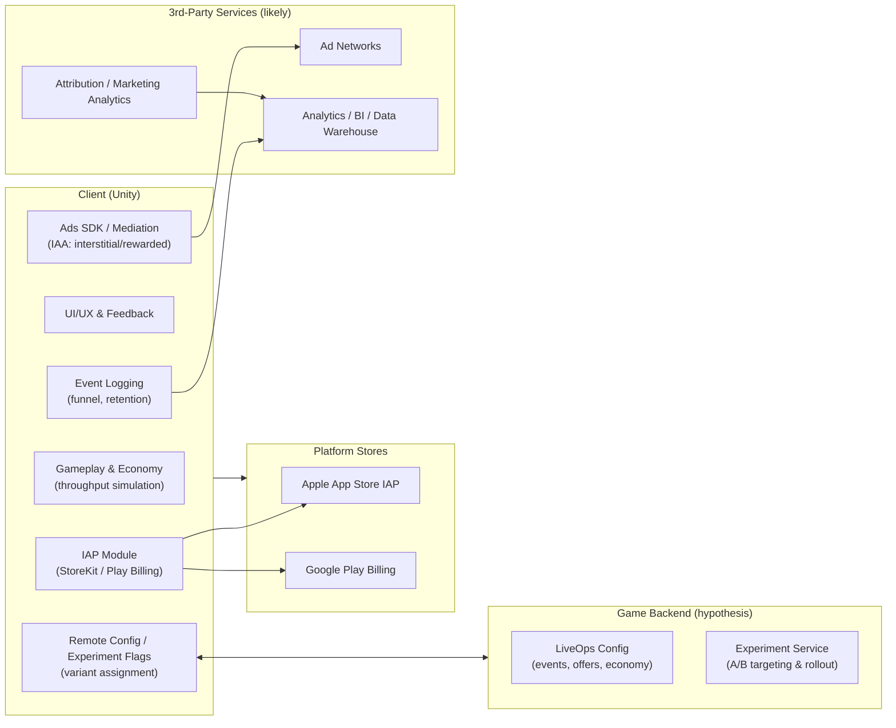

# Pizza Ready 게임 시스템 분석 리서치 보고서

## Executive Summary

Pizza Ready는 entity["company","Supercent Inc.","korean mobile game publisher"]가 개발·퍼블리싱한 모바일 레스토랑 운영(피자) 시뮬레이션으로, “카운터+드라이브 스루” 이중 판매 창구, 직원 고용/업그레이드, 매장 확장 및 체인화(주·지역 단위 확장)를 핵심 진행 구조로 내세운 하이브리드 캐주얼(Idle-Arcade 계열) 타이틀이다. citeturn52view0turn40view1

출시 시점은 2023년 7월(월 단위까지는 다수 출처에서 합치되지만, **공식 스토어 표기만으로 일자까지 확정은 어려워 ‘미확인’ 처리**)로 보는 것이 가장 보수적이며, 2024년 초부터 글로벌 다운로드가 급증했다는 서술(일일 다운로드 50만→최대 110만 수준, 스토어 인텔리전스 추정치)과 연간 다운로드 1.71억(추정치) 같은 지표가 여러 산업 리포트/기사에서 반복된다. citeturn45view3turn22view0

규모 측면에서 공개 추정치는 시점·모수·플랫폼 포함 범위에 따라 편차가 있으나, 2025년 말 기준 “글로벌 누적 다운로드 약 4억” 언급과 2026년 2월 기준 Android 단독 추정 3.2억(최근 30일 약 1,200만 다운로드) 같은 수치가 확인된다. citeturn45view1turn15view0 IAP 매출은 누적 830만 달러(추정) 수준이 공개적으로 언급되며, 이는 **광고 매출을 포함하지 않는 지표**라 총 매출(LTV) 판단에는 별도 보정이 필요하다. citeturn46view0

시스템 관점에서 Pizza Ready의 설계 강점은 (1) 짧은 작업 단위(생산→운반→서빙→정산/청소)의 반복으로 즉각적 성취감을 만드는 “마이크로 매니지먼트 루프”, (2) 자동화(직원 고용)로 피로를 낮추며 장기 세션을 구성하는 “전환 루프”, (3) 첫 세션에서 혼란/이탈을 줄이기 위한 **데이터 기반 FTUE 개선(A/B 테스트로 D1·튜토리얼 완료·세션 체류 개선)**에 있다. citeturn25view2turn25view3turn46view0

수익화는 IAA(광고)와 IAP(패키지·부스트·광고제거)를 혼합하는 하이브리드 구조로, 외부 리포트에서 “대략 광고 70% / 구매 30%” 같은 비율이 제시되며, 설계상 리워디드 비디오를 광범위하게 배치하는 것이 특징으로 요약된다. citeturn39view1turn39view2 다만 사용자 리뷰 기반으로는 강제 광고 빈도가 높다는 불만도 크고(“1~2분마다” 등), 이는 장기 리텐션·평점 유지에 비용으로 작동할 가능성이 높다. citeturn40view0turn52view0

데이터·프라이버시 측면에서는 광고 식별자/디바이스 ID, 이용 행태(게임 진행 데이터) 등 수집·활용과 맞춤형 광고, 파트너 기반 광고/분석 SDK 활용이 명시돼 있으며, “쿠키/유사 기술로 디바이스 그래프 구성” 같은 진술도 있어 규제(GDPR/CCPA/국내 개인정보보호) 및 신뢰 리스크 관리가 중요하다. 또한 프리미엄 기능의 대가로 “Bright Data 네트워크 피어” 선택 가능하다는 조항이 있어(명시된 옵트아웃 안내 포함) 사용자 고지·동의 품질이 핵심 이슈가 된다. citeturn30view0turn30view3  
(출처 URL: `https://apps.apple.com/us/app/pizza-ready/id6450917563`, `https://play.google.com/store/apps/details?id=io.supercent.pizzaidle`, `https://medium.com/supercent-blog/redesigning-the-ftue-of-pizza-ready-11eda193fa2e`, `https://sensortower.com/ko/blog/Supercent-rises-to-7th-place-globally-in-publisher-downloads`)

## 게임 개요

### 개발사·출시·플랫폼·장르

Pizza Ready는 App Store에서 개발사가 Supercent, Inc.로 표기되며, iOS 카테고리는 “Casual”로 분류된다. citeturn52view0 Google Play에서는 “Simulation” 태그(Management/Restaurant 등)로 노출되며, Android뿐 아니라 Windows(구글 플레이 PC 환경)에서도 “Available on Android, Windows”로 안내된다. citeturn40view1

출시일은 “2023년 7월”까지는 다수 출처에서 일치하지만, **스토어(Apple/Google) 내에서 ‘출시일’ 필드를 본문 텍스트로 명확히 노출하지 않아 일자 확정은 미확인**으로 처리한다. Android에 대해서는 AppBrain이 “Google Play에서 2023년 7월부터 제공”이라고 명시하며, 연간 다운로드 분석 기사에서도 “2023년 7월 출시”로 서술한다. citeturn15view0turn22view0

플랫폼 호환성은 iOS에서 iPhone/iPad뿐 아니라 Apple Silicon 기반 Mac 및 Apple Vision까지 호환 정보가 노출된다(플랫폼/호환 목록). citeturn11view2

**신뢰도 평가:** 높음(스토어 1차 정보) + 중간(Android 출시월은 AppBrain 추정/집계 기반)  
(출처 URL: `https://apps.apple.com/us/app/pizza-ready/id6450917563`, `https://play.google.com/store/apps/details?id=io.supercent.pizzaidle`, `https://www.appbrain.com/app/pizza-ready/io.supercent.pizzaidle`, `https://mobilegamer.biz/the-top-mobile-game-downloads-of-2024/`)

### 다운로드·매출 추정치

**다운로드(추정):** 공개 수치는 “어느 시점/어느 플랫폼/어느 계측사”에 따라 편차가 존재한다.

- 2025년 11월 발표된 entity["company","Sensor Tower","mobile app intelligence"]의 한국어 블로그 포스트는 Pizza Ready의 글로벌 누적 다운로드를 “약 4억”으로 언급한다. citeturn45view1turn46view0  
- entity["company","AppBrain","app store intelligence"](Android 앱 통계)에서는 2026년 2월 기준 “총 3.2억 다운로드, 최근 30일 약 1,200만 다운로드, Google Play 제공 시작 2023년 7월”로 설명한다. citeturn15view0  
- 하이퍼/하이브리드 캐주얼 산업 리포트(entity["organization","Gamesforum","mobile gaming events organizer"] / AppMagic 기반 집계라고 명시)에서는 2025년 중반 맥락에서 “lifetime 2.63억, 최근 30일 1,450만” 같은 수치를 제시한다. citeturn38view0turn39view1  
- 2024년 연간 다운로드 집계 기사(AppMagic 차트 기반, 추정치)는 2024년 한 해 1.71억 다운로드, 2024년 8~12월 월 1,000~1,200만 다운로드 수준으로 서술한다. citeturn22view0

이들 수치를 종합하면, **2024~2026 기간에 글로벌 누적 다운로드가 2.6억~4억+ 범위로 보고**되며, “최근 30일 신규 유입(다운로드)” 역시 수백만~천만 단위로 움직였음을 시사한다(단, 활성 사용자와는 별개). citeturn15view0turn46view0turn39view2

**매출(추정):**  
공개·인용 가능한 범위에서 가장 확실한 것은 **IAP(인앱 결제) 매출 추정치**다. Sensor Tower는 누적 인앱 구매 수익을 830만 달러로 언급하며, 그중 40%가 ‘올해’ 발생했다고 덧붙인다(동일 글 내). citeturn46view0 다만 Pizza Ready는 구조적으로 광고 의존도가 높은 게임으로 분류되며, 외부 리포트는 “광고 70% / 구매 30%” 같은 혼합 비율을 제시한다. citeturn39view1turn39view2 따라서 **총매출(광고+IAP) 추정치는 공개 자료만으로는 ‘미확인’**으로 두는 것이 안전하다.

**신뢰도 평가:**  
- 다운로드: 중간(시장 인텔리전스/집계 기반 추정치, 다수 출처 교차검증으로 신뢰 상승)  
- IAP 매출: 중간~높음(Sensor Tower 공개 블로그에 수치 명시)  
- 총매출: 미확인(광고 매출 비공개)  
(출처 URL: `https://sensortower.com/ko/blog/Supercent-rises-to-7th-place-globally-in-publisher-downloads`, `https://www.appbrain.com/app/pizza-ready/io.supercent.pizzaidle`, `https://investgame.net/wp-content/uploads/2025/07/Gamesforum-Intelligence-Hypercasual-Gaming-Report.pdf`, `https://mobilegamer.biz/the-top-mobile-game-downloads-of-2024/`)

## 코어 루프와 메커닉 분석

### 플레이 흐름과 코어 루프

스토어 설명을 기준으로 Pizza Ready의 기본 플레이는 “피자 생산/서빙/청소/직원 관리”를 포함한 레스토랑 운영 시뮬레이션이며, “카운터+드라이브 스루” 이중 판매 창구와 “체인 확장”을 핵심 판타지로 설계하고 있다. citeturn52view0turn40view1 이를 시스템 관점에서 재구성하면 **단기 반복 루프(운영)**와 **중기 성장 루프(확장/자동화)**가 결합된 형태다.

```mermaid
flowchart TD
  A[세션 시작/매장 진입] --> B[고객 주문·대기열 생성]
  B --> C[생산 라인 가동\n(직접 운반/직원 자동화)]
  C --> D[서빙\n(카운터/드라이브 스루)]
  D --> E[결제/재화 획득]
  E --> F[테이블 회전/청소\n(대기열 처리속도 개선)]
  F --> G[업그레이드/고용/설비 확장\n(처리량↑, 병목↓)]
  G --> B
  G --> H[지점/체인 확장\n(맵 진행·새 컨셉 매장)]
  H --> A
  G --> I[보상 선택\n(리워디드·패키지·No-Ads)]
  I --> G
```

위 루프에서 “고객 식사 시간(8~9초)” 같은 **의도치 않은 유휴 구간**이 초기 이탈 요인이 될 수 있으며, 실제로 Supercent 내부 분석에서도 튜토리얼 구간에서 고객이 식사하는 동안 플레이어가 8~9초 대기하며 가이드/피드백이 부족하다고 지적했다. citeturn25view2 이는 코어 루프가 “항상 할 일 있는 상태”를 유지해야 하는 Idle-Arcade 계열 특성과 직접 연결된다.

**신뢰도 평가:** 높음(스토어 설명·공식 블로그 기반, 코어루프 재구성은 분석적 해석)  
(출처 URL: `https://apps.apple.com/us/app/pizza-ready/id6450917563`, `https://play.google.com/store/apps/details?id=io.supercent.pizzaidle`, `https://medium.com/supercent-blog/redesigning-the-ftue-of-pizza-ready-11eda193fa2e`)

image_group{"layout":"carousel","aspect_ratio":"16:9","query":["Pizza Ready mobile game gameplay screenshot restaurant","Pizza Ready drive thru gameplay screenshot","Pizza Ready restaurant simulator screenshot upgrade"],"num_per_query":1}

### 주요 메커닉과 경제 구조

공식 설명에서 반복적으로 등장하는 메커닉은 (1) 이중 판매 창구로 처리량을 늘리는 운영, (2) 직원 고용 및 스킬 업그레이드(자동화), (3) 무한 확장/체인화다. citeturn52view0turn40view1 여기에 업데이트 히스토리(서비스 테이블 도입, 로봇 역할 확장 등)가 암시하듯, 현재 라이브 버전은 “청소→서빙→다중 업무”를 자동화 개체(로봇/직원)로 점진 확장하며 병목을 해소하는 설계를 강화해왔다. citeturn52view0

경제(재화) 관점에서 Pizza Ready는 **단일 매장 내 처리량(throughput)과 병목(bottleneck) 관리**가 핵심이며, 플레이어가 직접 운반/정산을 수행하는 “수동 운영”에서 직원 고용으로 “준자동/자동 운영”으로 넘어갈수록 플레이 부담이 낮아지는 전형적 하이브리드 캐주얼 패턴을 갖는다. 한국어 분석 블로그에서도 초반에는 직접 배달/테이블 정리 등의 개입이 있으나, 직원 고용 이후 방치형으로 전환되며 후반에는 손댈 일이 크게 줄어든다고 요약한다. citeturn26view0

**신뢰도 평가:**  
- 메커닉 목록: 높음(스토어/업데이트 기반)  
- “후반 방치 전환” 체감: 중간(3자 분석 블로그 기반)  
(출처 URL: `https://apps.apple.com/us/app/pizza-ready/id6450917563`, `https://play.google.com/store/apps/details?id=io.supercent.pizzaidle`, `https://todah.tistory.com/101`)

### 레벨·난이도·콘텐츠 구조

Google Play 설명은 “progression levels, events”를 명시하고, App Store 설명은 “Every State 체인 확장”을 강조한다. citeturn40view1turn52view0 즉, 난이도·진행은 퍼즐형 ‘스테이지’라기보다 **(a) 매장 내부 확장(공간·설비·직원) → (b) 지점/맵 단위 확장**의 형태로 조직된다.

다만 난이도 설계의 민감 지점은 “광고/보상 기반 부스트”가 처리량 병목을 얼마나 빠르게 해소하게 하느냐에 있다. 외부 산업 리포트는 리워디드 비디오가 “거의 모든 부스트/핵심 업그레이드”의 획득 경로가 될 수 있다고 언급하며, 이는 난이도(병목) 곡선을 광고 시청으로 평탄화하는 구조로 해석된다. citeturn39view2 사용자 리뷰에서도 특정 구간 이후 광고 빈도가 체감상 급증하고(“매분”, “20초마다” 등), 업그레이드/부스트가 광고 유도 버튼과 결합되어 있다는 불만이 반복된다. citeturn40view2turn52view0

**신뢰도 평가:**  
- “이벤트/레벨/체인 확장” 구조: 높음(스토어)  
- “광고가 난이도 완화의 핵심 레버” 해석: 중간(산업 리포트 기반)  
- “광고 체감 난이도” 서술: 낮음~중간(리뷰는 표본 편향 가능)  
(출처 URL: `https://play.google.com/store/apps/details?id=io.supercent.pizzaidle`, `https://apps.apple.com/us/app/pizza-ready/id6450917563`, `https://investgame.net/wp-content/uploads/2025/07/Gamesforum-Intelligence-Hypercasual-Gaming-Report.pdf`)

## UX·감정 설계

### 피드백·이펙트·상태 기반 UX

Pizza Ready의 “즉각적 만족감”은 **상태 변화가 눈에 보이는 오브젝트(피자 스택/테이블/대기열)와 처리량 상승(업그레이드)**에서 나온다(Idle-Arcade 전형). 이때 UX 품질을 좌우하는 것은 “지금 가능한 행동 vs 불가능한 행동”을 명확히 구분하는 상태 기반 피드백이다. Supercent의 FTUE 개선 글에서, 기존 튜토리얼은 (1) 시야 밖에 뜨는 방향 화살표, (2) 카메라 포커싱 타이밍 불일치, (3) 유휴 구간(8~9초) 방치, (4) 돈이 부족한데도 결제/지출을 유도하는 UI, (5) 불가능한 행동 시 교정 피드백 부재를 문제로 진단했다. citeturn25view2

개선안은 “불가능 상태에서는 버튼/프롬프트를 제거”하고, 잘못된 위치/행동에는 “흔들림(Shake) + 네거티브 사운드 + 안내 메시지”를 부여하는 형태였다. citeturn25view2turn25view3 이는 **좌절을 ‘학습 가능한 실패’로 변환**하는 전형적 캐주얼 UX 전략이며, 특히 non-gamer 비중이 큰 타겟에서 효과가 크다(동 글은 다양한 플레이 습관을 관찰했다고 설명). citeturn25view0

**신뢰도 평가:** 높음(공식 블로그의 문제·개선·근거 제시)  
(출처 URL: `https://medium.com/supercent-blog/redesigning-the-ftue-of-pizza-ready-11eda193fa2e`)

### 보상 타이밍·세션 리듬

보상 타이밍(Rewards cadence)에서 특히 중요한 지점은 “광고 노출 시점”이다. Sensor Tower의 FTUE 분석 요약에 따르면, Pizza Ready는 첫 광고가 3분 13초 이후에 등장하도록 설계되어(비교 타이틀은 41초~1분 33초 수준) 플레이어가 기본 조작과 흐름에 몰입한 뒤 광고를 접하게 한다. citeturn46view0 이는 “첫 세션 이탈 방지” 관점에서 합리적이며, 실제로 Supercent는 FTUE 재설계에서 튜토리얼 이탈을 정밀 이벤트로 쪼개고(퍼널 이벤트 세분화), 유휴 구간의 안내/피드백을 보강했다. citeturn25view2turn25view3

반면 장기 세션에서는 광고 빈도·형태가 감정 곡선을 흔들 수 있다. Google Play와 App Store의 리뷰들에서 “매우 잦은 강제 광고”가 반복적으로 언급되며, “15초 break” 같은 문구로 사실상 인터럽트 광고를 정당화한다는 서술도 보인다. citeturn40view0turn52view0 이는 **초반(FTUE)에서는 광고를 늦추되, 이후 구간에서 과도한 강제 광고로 전환**되는 경우에 흔히 나타나는 패턴이며, 이 경우 “광고 제거 IAP” 전환에는 도움이 되더라도 장기 리텐션/평점/자연 유입에는 손실이 생길 수 있다(정량은 미확인).

**신뢰도 평가:**  
- “첫 광고 3:13” 및 의도: 높음(Sensor Tower)  
- “후반 광고 과다 체감”: 낮음~중간(리뷰 기반)  
(출처 URL: `https://sensortower.com/ko/blog/Supercent-rises-to-7th-place-globally-in-publisher-downloads`, `https://play.google.com/store/apps/details?id=io.supercent.pizzaidle`, `https://apps.apple.com/us/app/pizza-ready/id6450917563`)

## 수익모델

### IAA·IAP 구성과 광고 포맷

스토어 표기상 Pizza Ready는 무료(F2P)이며 IAP가 존재한다. citeturn52view0turn40view1 App Store의 IAP 목록에는 “No Ads $3.99”가 명시되어 광고 제거형 결제가 존재함을 확인할 수 있다. citeturn11view2 또한 “battle pass”로 해석 가능한 상품명(예: 시즌성 패스) 및 다양한 패키지 SKU가 노출되는데, 이들이 **구독형인지(자동 갱신) 여부는 스토어 목록만으로는 미확인**이다. citeturn11view2

외부 산업 리포트는 수익화 구조를 다음과 같이 요약한다:  
- “Frequent rewarded videos”: 대부분의 부스트/중요 업그레이드가 영상 시청으로 획득 가능  
- “Bundled IAPs”: 업데이트로 프리미엄 번들/패스가 게임플레이에 내장  
- “Hybrid revenue mix”: 대략 광고 70% / 구매 30%  
citeturn39view2turn39view1

이를 시스템 설계로 번역하면 다음 표처럼 정리할 수 있다.

| 수익화 레버 | 설계 의도 | 플레이 경험에 미치는 영향 | 공개 근거 |
|---|---|---|---|
| 강제 인터럽트(추정: 인터스티셜) | 세션당 노출수 확장, eCPM 최적화 | 몰입 저하·평점 하락 위험(리뷰 불만) | 리뷰 기반(낮음) citeturn40view2turn52view0 |
| 리워디드 비디오 | “병목 해소”를 광고로 치환(경제 속도 유지) | 보상 선택권이 있어 상대적으로 수용성 높음 | 산업 리포트(중간) citeturn39view2 |
| 광고 제거 IAP | 불만을 결제로 전환 | 광고 스트레스 감소, 결제 장벽 낮음(3.99달러) | App Store IAP(높음) citeturn11view2 |
| 번들/패스 IAP | 헤비 유저의 지불 의사 회수 | 라이브 서비스/수집/부스트와 결합 시 LTV↑ | 산업 리포트(중간) citeturn39view2 |

**신뢰도 평가:** IAP/No-Ads 존재는 높음(스토어), 광고 믹스 비율은 중간(산업 리포트), 강제 광고 빈도는 낮음~중간(리뷰 기반)  
(출처 URL: `https://apps.apple.com/us/app/pizza-ready/id6450917563`, `https://investgame.net/wp-content/uploads/2025/07/Gamesforum-Intelligence-Hypercasual-Gaming-Report.pdf`)

### 광고 빈도·전개 전략

광고 빈도는 “첫 광고를 늦추는 FTUE(3:13)” 전략과 “후반부 광고 체감 과다” 피드백이 동시에 관찰된다. citeturn46view0turn40view2 이는 흔히 **초기 세션 확보(activation)와 단기 ARPDAU 극대화 사이의 긴장**으로 설명된다. 특히 대규모 UA를 동반한 하이브리드 캐주얼에서는 CPI를 방어하기 위해 초반 리텐션과 광고 수익을 동시에 끌어올리려는 유인이 강하다(아래 UA 파트 참고).

**신뢰도 평가:** 중간(첫 광고 시점은 명확, 후반 빈도는 리뷰 기반)  
(출처 URL: `https://sensortower.com/ko/blog/Supercent-rises-to-7th-place-globally-in-publisher-downloads`, `https://play.google.com/store/apps/details?id=io.supercent.pizzaidle`)

### UA(유저 획득)·광고 네트워크·크리에이티브

Sensor Tower의 2024년 4월 분석 글은 Pizza Ready 다운로드의 “약 70%가 유료 채널”에서 발생했다고 서술하며, 인도 시장에서 entity["company","Mintegral","mobile ad network"] 및 entity["company","AppLovin","mobile adtech company"] 네트워크 내 광고 점유율 순위가 상승했다고 설명한다. 또한 상위 광고 소재로 “플레이어블 광고” 형식을 확인했다고 언급한다. citeturn45view6 이는 Pizza Ready가 **플레이어블(체험형) + 현지화 문구**로 전환율을 올리고 대량 트래픽을 만든 전형적 하이브리드 캐주얼 UA 패턴과 부합한다.

2025년 11월 Sensor Tower 글에서는 인도 시장에서 광고 집행을 강화해 노출이 최고치를 기록했고, “Game with No Ads!” 메시지를 전면에 내세운 동영상 소재가 인상/관심을 끌었다고 서술한다. citeturn46view0 즉, **초반 ‘무광고처럼 느끼게 하는’ 메시지로 설치 전환을 올리고, 설치 후에는 하이브리드 광고/결제로 회수**하는 전략이 읽힌다(정량 ROAS는 미공개).

**신뢰도 평가:** 높음(Sensor Tower 공개 글의 정성·정량 서술)  
(출처 URL: `https://sensortower.com/ko/blog/Pizza-Ready-ranks-6th-globally-among-mobile-casual-games`, `https://sensortower.com/ko/blog/Supercent-rises-to-7th-place-globally-in-publisher-downloads`)

## 실험·데이터 인프라와 기술 스택·아키텍처

### A/B 테스트 사례·지표·운영 방식

Supercent의 공식 블로그는 Pizza Ready FTUE 개선 과정에서 다음을 명시한다:  
- 튜토리얼의 “drop-off 위치/맥락”을 파악하기 위해 퍼널 이벤트를 더 세분화(“granularity를 두 배”)함  
- 디자이너 의도 플로우 대비 실제 행동을 매핑하고, 다수의 플레이/세션 리플레이(“session replays”)로 붕괴 지점을 발견  
- 개선안 적용 후 A/B 테스트로 효과 검증: 튜토리얼 단계 유지 +8%p, 첫 세션 평균 플레이타임 +1.9분, D1 리텐션 +4.5% 개선  
citeturn25view2turn25view3

이는 실험 인프라 관점에서 “(1) 상세 이벤트 로깅, (2) 퍼널 분석, (3) 리플레이/세션 관찰, (4) A/B 프레임워크”가 갖춰져 있음을 강하게 시사한다(구체 툴명은 미공개). citeturn25view3

추가로, 한국어 기사(중국 게임 행사 발표 관련)에서는 Supercent가 자체 퍼블리싱 루프(PSL)를 중심으로 CPI 테스트, FTUE 검증, 리텐션·수익화 A/B 테스트, D7~D30 구간 콘텐츠 최적화, 세그먼트 운영 및 라이브 서비스 자동화 등을 “AI와 데이터 기반”으로 운영한다고 전한다(기사 인용). citeturn23search6

**신뢰도 평가:** 높음(공식 블로그의 A/B 수치) + 중간(언론 기사 인용은 세부 구현 미확인)  
(출처 URL: `https://medium.com/supercent-blog/redesigning-the-ftue-of-pizza-ready-11eda193fa2e`, `https://m.inven.co.kr/webzine/wznews.php?idx=308036`)

### 데이터·광고·프라이버시: 수집 범위와 리스크 표식

Supercent의 개인정보처리방침에서는 자동 수집 데이터로 “내부 계정 ID, IP 주소, 디바이스 식별자(광고 ID 포함), 쿠키/유사 기술, 서비스 이용 데이터(게임플레이 데이터 등)”를 열거한다. citeturn29view0turn30view5 또한 맞춤형 광고 제공을 위해 파트너 SDK/기능이 포함될 수 있고, 쿠키/유사 기술로 여러 디바이스/브라우저를 연결하는 “device graph”를 구성할 수 있다고 명시한다. citeturn30view3

특기할 조항으로, “프리미엄 기능의 대가로 Bright Data 네트워크 피어가 될 수 있으며(‘web indexing’ off로 opt-out 가능)”가 정책에 포함돼 있다. citeturn30view0 이는 단순 광고/분석을 넘어 **네트워크 리소스 공유(해석상)** 가능성을 포함하므로, 실제 앱 내 고지 UX·동의 구조가 어떻게 되어 있는지에 따라 윤리·규제 리스크가 크게 달라진다(앱 내 실제 구현은 미확인).

플랫폼별 표기에서도 추적/광고 관련 신호가 확인된다. App Store “App Privacy”에는 “Data Used to Track You: Identifiers”가 표시되고, “Third-Party Advertising/Marketing/Analytics” 목적으로 coarse location 및 device ID 등이 “Not Linked” 형태로 표시된다. citeturn11view7 Google Play “Data safety”에는 제3자 공유 가능 데이터 타입(위치, 앱 정보/성능, 기기 ID 등), “Data isn’t encrypted”, “Data can’t be deleted” 같은 표식이 함께 노출된다(개발자 자가 선언 기반). citeturn40view1

**신뢰도 평가:** 높음(공식 정책·스토어 표기)  
(출처 URL: `https://corp.supercent.io/PrivacyPolicy`, `https://apps.apple.com/us/app/pizza-ready/id6450917563`, `https://play.google.com/store/apps/details?id=io.supercent.pizzaidle`)

### 기술 스택·SDK·아키텍처 추정

**클라이언트 엔진(확인):**  
Android 패키지 구성에서 `com.unity3d.player.UnityPlayerActivity`가 명시되어, Pizza Ready 클라이언트가 entity["company","Unity","game engine company"] 기반임을 강하게 뒷받침한다. citeturn41view0

**광고/분석 SDK(부분 추정):**  
Supercent 채용 공고(플랫폼 개발자)에서 “복잡한 SDK(Facebook, Adjust, Firebase, 광고, 결제 등) 연동 구조 설계·구현 경험”을 요구하고, Unity3D/C# 및 모바일 빌드 체인(Xcode/Gradle 등)을 열거한다. citeturn35search0 이는 특정 게임 단위가 아니라 “회사 공통 플랫폼”일 가능성이 높지만, 적어도 Supercent 조직이 **어트리뷰션·분석·광고·결제 SDK를 다수 통합하는 역량/프레임워크를 지향**함을 보여준다(게임별 실제 탑재는 미확인).

**서버/백엔드(미확인, 합리적 추정):**  
멀티플레이가 아닌 운영 시뮬레이션 특성상 핵심 시뮬레이션은 클라이언트에서 처리하되, (a) 라이브 이벤트(예: 크리스마스 이벤트) citeturn52view0, (b) 원격 밸런싱/리모트 설정, (c) A/B 실험 분기, (d) 구매 검증/영수증 처리, (e) 데이터 수집 파이프라인은 서버 및 서드파티로 구성됐을 가능성이 높다. 또한 개인정보처리방침에서 “hosting, advertising, analytics, fraud prevention”을 수행하는 벤더가 있다고 명시해, 외부 서비스 연동이 전제됨을 확인할 수 있다. citeturn30view0

아래 다이어그램은 **확인된 요소(유니티 클라이언트, 스토어·광고·분석 연동)**와 **정상적 업계 관행에 따른 추정(리모트 설정·실험·라이브옵스)**을 분리해 그린 것이다.



**신뢰도 평가:**  
- Unity 기반: 높음(패키지 근거)  
- 특정 SDK 목록: 낮음~중간(채용공고는 회사 공통, 게임별 미확인)  
- 백엔드 구성: 낮음(업계 관행 기반 추정, 공개 자료 부족)  
(출처 URL: `https://iconpusher.com/package/io.supercent.pizzaidle`, `https://supercent.career.greetinghr.com/ko/o/191184`, `https://corp.supercent.io/PrivacyPolicy`)

## 경쟁 분석

### 유사 게임 비교

아래 표는 Pizza Ready와 동일한 “serve/upgrade/expand” 계열의 하이브리드 캐주얼 운영 시뮬레이션 3종을 비교한 것이다. 활성 사용자(DAU/MAU)는 신뢰할 만한 공개 수치가 제한적이므로 **미확인**으로 표기하고, 대신 공개 가능한 **대체 지표(최근 30일 다운로드·총 다운로드)**를 함께 제공한다(=유입 규모 proxy). citeturn15view0turn44view0turn43view0turn44view1

| 구분 | 핵심 차별점 | 수익모델(공개 표기/관찰) | DAU/MAU 추정 | 대체 지표(최근 30일 다운로드, 총 다운로드) |
|---|---|---|---|---|
| Pizza Ready | 이중 판매 창구(카운터+드라이브스루), 체인 확장, FTUE/퍼널 기반 UX 개선 강조 citeturn52view0turn25view3 | 하이브리드(광고+IAP), No-Ads IAP 확인 citeturn11view2turn39view2 | **미확인**(공개 DAU/MAU 부재) | Android 기준 최근 30일 약 1,200만 / 총 3.2억(추정) citeturn15view0 |
| entity["video_game","Burger Please!","Supercent mobile game"] | 동일 개발사의 음식점 운영 변주(버거 테마), 유사한 자동화·확장 패턴 citeturn44view0 | Contains ads + IAP(스토어/코멘트 기반) citeturn44view0 | **미확인** | 최근 30일 약 48만 / 총 9,700만(추정) citeturn44view0 |
| entity["video_game","My Perfect Hotel","SayGames mobile game"] | 호텔 운영(청소·객실·직원)로 테마 전환, 아케이드/타임매니지먼트 감각 강화 citeturn43view0 | Contains ads + IAP(스토어/코멘트 기반) citeturn43view0 | **미확인** | 최근 30일 약 190만 / 총 1.8억(추정) citeturn43view0 |
| entity["video_game","My Mini Mart","Supersonic mobile game"] | 생산(농장/가공)→판매의 공급망 성격, 상대적으로 장기 성장형 citeturn44view1 | Contains ads + IAP(스토어/코멘트 기반) citeturn44view1 | **미확인** | 최근 30일 약 17만 / 총 1억(추정) citeturn44view1 |

**해석 포인트:** Pizza Ready는 (1) 대량 UA가 만들어낸 큰 유입(최근 30일 다운로드가 경쟁작 대비 매우 큼) citeturn15view0, (2) 퍼널/FTUE 최적화로 “초반 이탈”을 억제한 운영 역량을 공개적으로 제시한다는 점 citeturn25view3, (3) 광고와 결제를 강하게 결합한 하이브리드 구조(보상형 광고 중심)를 외부 리포트에서 반복 서술한다는 점이 차별점이다. citeturn39view2turn45view6

**신뢰도 평가:** 중간(다운로드는 AppBrain 추정치, DAU/MAU는 공개 근거 부족)  
(출처 URL: `https://www.appbrain.com/app/pizza-ready/io.supercent.pizzaidle`, `https://www.appbrain.com/app/burger-please/io.supercent.burgeridle`, `https://www.appbrain.com/app/my-perfect-hotel/com.master.hotelmaster`, `https://www.appbrain.com/app/my-mini-mart/com.KisekiGames.smart`)

## 리스크·윤리와 개선 제안

### 리스크·윤리 이슈

**프라이버시·추적·동의 리스크:**  
- 개인정보처리방침은 광고 ID/디바이스 식별자, 게임플레이 데이터, 파트너 기반 광고·분석, device graph 구성 가능성을 명시한다. citeturn30view3turn30view5 이는 규제 준수 자체보다도 “유저가 이해 가능한 고지/옵션 제공”이 품질 리스크로 이어진다.  
- “Bright Data 네트워크 피어” 조항은 특히 민감하다. 사용자가 “프리미엄 기능의 대가로” 네트워크에 참여할 수 있다고 명시되어 있어, 실제 앱 내에서 이 선택이 어떤 UX(명시적 체크/설명/철회 경로)로 제공되는지가 핵심이다. citeturn30view0 (현재 자료만으로 앱 내 고지 수준은 미확인)  
- Google Play 데이터 안전 표식에서 “Data isn’t encrypted”, “Data can’t be deleted”가 노출된다. citeturn40view1 이 표식은 기술적 의미가 단정되기 어렵지만, 이용자 신뢰에 직접 영향을 준다.

**과실험(Over-Experimentation)·개인화 오용:**  
- FTUE 개선 사례는 퍼널 이벤트 세분화 및 A/B 테스트로 의미 있는 개선을 달성한 긍정 사례다. citeturn25view3  
- 반면, 동일한 실험 역량이 “광고 빈도/패키지 노출”을 공격적으로 최적화할 때, 단기 ARPDAU 최적화가 장기 리텐션·평점·브랜드 신뢰를 훼손할 수 있다(리뷰 기반 불만 다수). citeturn40view2turn52view0

**DDA(동적 난이도 조정) 오용 가능성(미확인):**  
하이브리드 캐주얼 운영 게임은 병목을 설계하고(대기열·처리량), 이를 업그레이드/광고/결제로 해소하게 만든다. citeturn39view2turn52view0 이때 DDA가 “유저별 광고 노출/보상 효율”로 과도하게 결합되면, 이용자는 게임을 ‘조작’으로 인식할 수 있다. 현재 Pizza Ready의 DDA 존재 자체는 공개 자료로 확인되지 않아 **미확인**으로 표기한다.

**신뢰도 평가:** 높음(정책/스토어 표기 기반) + 중간(광고 경험은 리뷰) + 미확인(DDA 존재)  
(출처 URL: `https://corp.supercent.io/PrivacyPolicy`, `https://play.google.com/store/apps/details?id=io.supercent.pizzaidle`, `https://apps.apple.com/us/app/pizza-ready/id6450917563`)

### 개선 제안

아래 제안은 “공개 자료로 확인되는 문제 신호(광고 불만, 프라이버시 표식, FTUE 개선 경험)”를 기반으로, 실무적으로 실행 가능한 우선순위를 부여했다. citeturn25view3turn40view2turn30view0turn46view0

| 우선순위 | 제안 | 기대 효과(KPI 가설) | 구현 난이도 | 근거/리스크 |
|---|---|---|---|---|
| High | **강제 광고 빈도 상한 + 맥락 기반 배치**(예: 작업 완료/구역 전환 후만, 연속 인터럽트 금지, early-session 보호) | D1~D7 리텐션 및 평점 개선, 장기 LTV 방어 | 중간 | “첫 광고 3:13”의 장점을 후반까지 확장 citeturn46view0 / 과다 광고 불만 완화 citeturn40view2 |
| High | **리워디드 중심으로 수익화 재배치**(인터럽트→선택형 보상) + 보상가치 표준화 | 광고 수용성↑, ARPDAU 유지하면서 이탈↓ | 중간 | 산업 리포트가 “rewarded 중심”을 핵심으로 언급 citeturn39view2 |
| Medium | **상태 기반 UX 원칙(“불가능 프롬프트 제거/교정 피드백”)을 전 구간으로 확장** | 튜토리얼 이후 이탈 감소, 세션 만족도↑ | 중간 | FTUE에서 동일 원칙으로 성과 입증 citeturn25view2turn25view3 |
| Medium | **프라이버시/옵트아웃 UX 강화**(파트너 목록 접근성, 데이터 삭제/암호화 표식 개선, Bright Data 관련 고지·철회 UX 명확화) | 신뢰 리스크 완화, 규제/스토어 리스크 감소 | 중간~높음 | 정책상 device graph/광고 ID/피어 조항 존재 citeturn30view0turn30view3 / Google Play 표식 개선 필요 citeturn40view1 |
| Medium | **라이브 이벤트의 “게임플레이 가치” 강화**(단순 테마/수집→메커닉 변주·신규 병목/신규 자동화로 확장) | D7~D30 구간 활성화, 재방문 동기 강화 | 중간 | 크리스마스 이벤트 등 라이브옵스 존재 citeturn52view0 / 장기 유지가 핵심인 장르 특성 citeturn39view2 |

**신뢰도 평가:** 중간(문제 신호는 근거 있으나, 효과는 가설/경험적 추정)  
(출처 URL: `https://sensortower.com/ko/blog/Supercent-rises-to-7th-place-globally-in-publisher-downloads`, `https://medium.com/supercent-blog/redesigning-the-ftue-of-pizza-ready-11eda193fa2e`, `https://corp.supercent.io/PrivacyPolicy`, `https://play.google.com/store/apps/details?id=io.supercent.pizzaidle`)